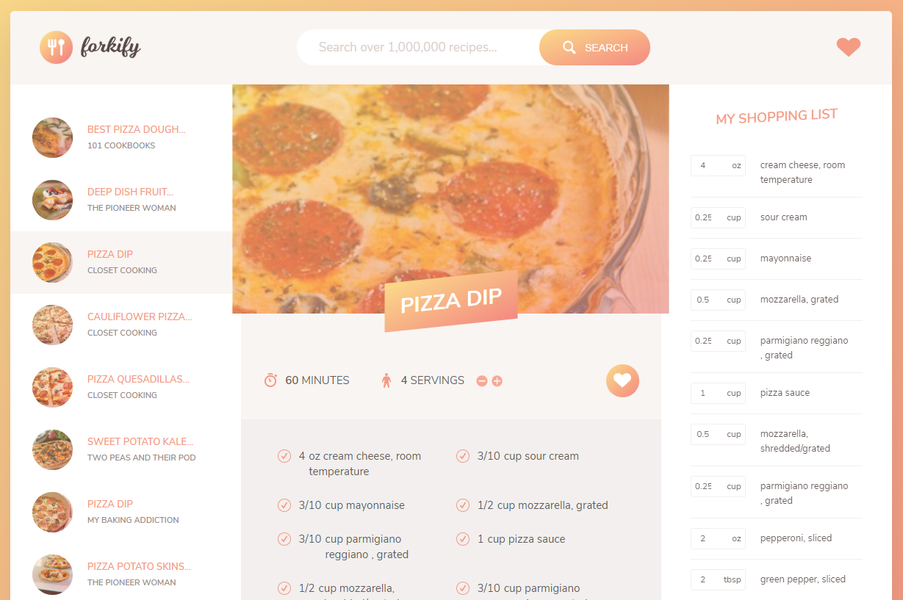

# Forkify App

This app was created as part of the [Complete JavaScript Course](https://www.udemy.com/course/the-complete-javascript-course) on Udemy.

#### Hosted App (now on Netlify)
[Click here!](https://dmatis-forkify.netlify.app/)

## How to Use
* Type an ingredient or food that you would like to make (ie: pizza)
* On the left sidebar, recipes will appear that match your query
* Selecting a recipe will open the instructions in the main page
  * You can 'Favorite' a recipe in order to keep track of it for later
  * You can also 'Add to Shopping Cart' to add the ingredients to the list on the right sidebar

## To Start the Development Server

* Ensure that you have Node.JS and npm installed
* Clone the repository
* `npm install`
* `npm run dev`
* Go to `localhost:8080` in your browser

## To Start the Production Build

* `npm install`
* `npm run build`
* `npm run start`
